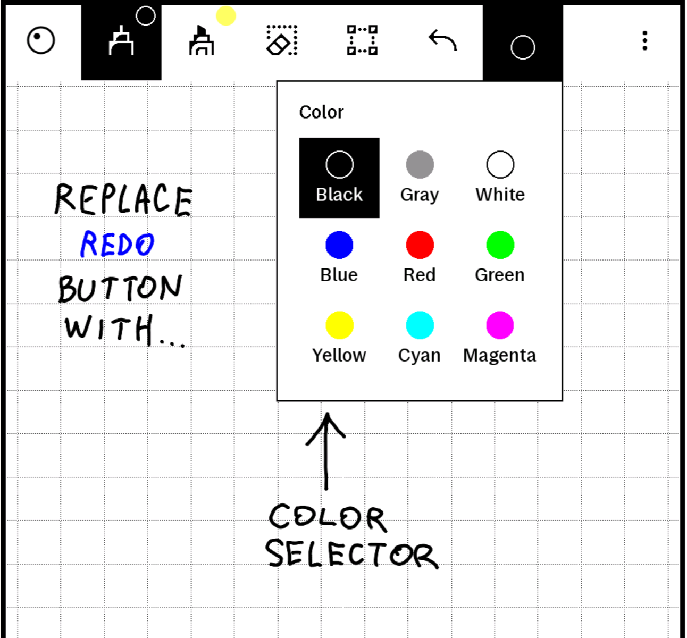
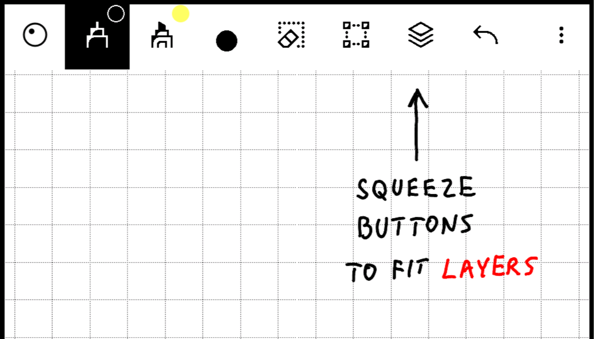

# xovi-qmd-extensions

QMD extensions for the reMarkable Paper Pro Move, loaded by [XOVI](https://github.com/asivery/xovi) and
[qt-resource-rebuilder](https://github.com/asivery/rm-xovi-extensions/tree/master/qt-resource-rebuilder).

Each file lives in a folder named after the xochitl version it was written for. The files may also work on nearby versions.

| Extension | Description |
|---|---|
| [colorDropdownOnMove.qmd](#colordropdownonmoveqmd) | Replaces the Redo button with a one-tap color picker for the active pen, placed right after the second pen. It can also show pen thickness, which you turn on or off in Settings. |
| [compactToolbarOnMove.qmd](#compacttoolbaronmoveqmd) | Makes toolbar buttons slightly narrower (104 instead of 112 px) so one more tool fits. On the Move this adds the Layers button to the toolbar. |
| [limitPenColors.qmd](#limitpencolorsqmd) | Lets you choose in Settings which pen, highlighter and shader colors are available. Hidden colors disappear from the pen menus and the color picker, for fewer distractions. |
| [layerIndicator.qmd](#layerindicatorqmd) | Shows the active layer's number in the corner of the Layers toolbar button. It appears only on pages with more than one layer. |

## How to install

1. Copy the `.qmd` file to `/home/root/xovi/exthome/qt-resource-rebuilder/` on the tablet.
2. Restart xochitl through xovi (`xovi/start`).
3. After an OS update, run `xovi/rebuild_hashtable`.

To uninstall, delete the file and restart xochitl.

## Extensions

### colorDropdownOnMove.qmd

Replaces the **Redo** button in the document toolbar with a color picker for the active pen.

On the Paper Pro Move the toolbar has only a few slots. Changing color normally takes two taps: open the pen menu,
then pick a color. This extension puts the color palette one tap away.

- The button shows a dot in the current pen color.
- Tap it to open a grid with the pen menu's colors. The highlighter and shader palettes appear when those tools are active.
- Picking a color applies it to the active pen, primary or secondary, and closes the panel. Tapping the button again also closes it.
- Below the colors, a thickness row lets you change the pen's thickness. Picking a thickness also closes the panel.
  The row is hidden for highlighters, which have no thickness choice.
- The button is disabled while the eraser or the selection tool is active.
- The button is moved right after the second pen.

Redo is no longer on the toolbar. Undo stays.

**Settings:** to turn the thickness row on or off, use the **Color picker: thickness** toggle in Settings, below
**Toolbar position**. It is on by default. The change takes effect the next time you open the color picker.

If `limitPenColors.qmd` is installed, the color picker shows only the colors you left available.

Works well together with ingatellent's
[enableSecondaryPenOnMove.qmd](https://github.com/ingatellent/xovi-qmd-extensions/blob/main/3.28/enableSecondaryPenOnMove.qmd)
and [hideDocumentClose.qmd](https://github.com/ingatellent/xovi-qmd-extensions/blob/main/3.28/hideDocumentClose.qmd).

Tested on xochitl 3.28.0.172 (Paper Pro Move). It may work on the Paper Pro too, but that is untested.

### compactToolbarOnMove.qmd

Makes the toolbar buttons slightly narrower, so one more tool fits on the toolbar.

Stock buttons are 112 px wide. On the Move's short edge that leaves room for 7 tools, even with the close button hidden.
This extension reduces each slot to 104 px, which gives 8 tools. The next tool by priority, **Layers**, then appears on the toolbar.

- Only the padding shrinks. Icons keep their size, and the toolbar keeps its thickness.
- It works for top, bottom and side toolbar positions.
- To tune it, change `compactToolSize` at the top of the file. On the Move, 106 or less gives the extra slot.

Tested on xochitl 3.28.0.172 (Paper Pro Move), together with `colorDropdownOnMove.qmd`, `enableSecondaryPenOnMove.qmd` and `hideDocumentClose.qmd`.

### limitPenColors.qmd

Choose which colors are offered for pens, highlighters and shaders. Fewer colors mean fewer distractions and
a smaller color picker.

- In Settings, below **Toolbar position**, the **Available colors** panel shows the Pens, Highlighter and Shader palettes.
  Highlighted swatches are available. Tap a swatch to show or hide it.
- Hidden colors disappear from the stock pen menus and from the `colorDropdownOnMove.qmd` color picker.
- The last visible color of a palette can't be hidden.
- The change takes effect the next time a menu opens. You don't need to restart.
- Hiding a color doesn't change strokes you've already drawn, and it doesn't change the pen's current color.

Works on its own. Also works together with `colorDropdownOnMove.qmd`, and it doesn't matter which one is installed first.

Tested on xochitl 3.28.0.172 (Paper Pro Move).

### layerIndicator.qmd

Shows which layer is active, as a small number in the top corner of the **Layers** toolbar button.

- 1 is the bottom (default) layer, 2 is the layer above it, and so on.
- The number is shown only when the page has more than one layer.
- It is shown only on the toolbar button itself, not in the overflow menu.

Works well with `compactToolbarOnMove.qmd`, which makes room for the Layers button on the Move's toolbar.

Tested on xochitl 3.28.0.172 (Paper Pro Move).

## License

[MIT](LICENSE)
